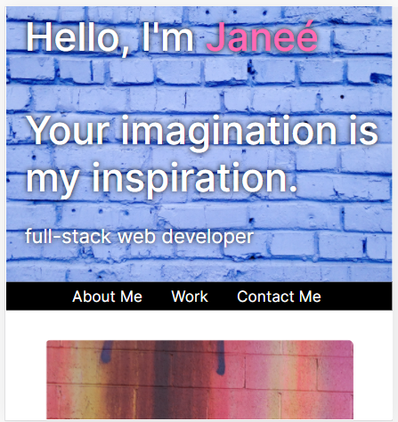

# professional-materials
Updated portfolio page and other materials to build toward being employer-competitive

# Description

I began the project by viewing my original submission. Although I contemplated revising my original, I ultimately decided to start from scratch. I began by implementing bootstrap to utilize the grid system. I thought it would help with responsiveness but there were several elements that didn't seem to be effected. I also had trouble deciding on a theme. My final submision is the result of three prior unsatisfactory themes. 

The tools I utilized to create my portfolio were unsplash stock photos, ajax icons, bootstrap grid systems, and css. In the future I would like to work more on responsiveness. 

https://janee-elise-mays.github.io/professional-materials/
https://github.com/janee-elise-mays/professional-materials

